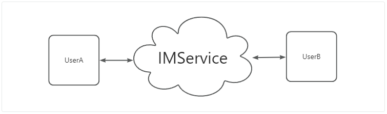
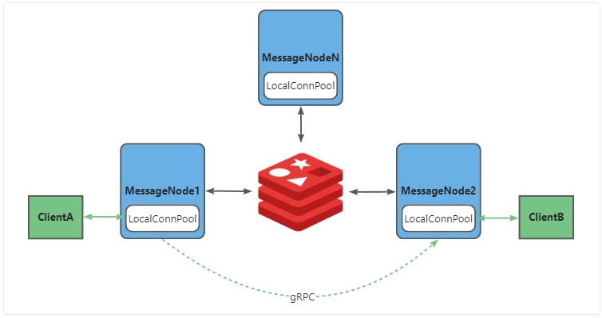
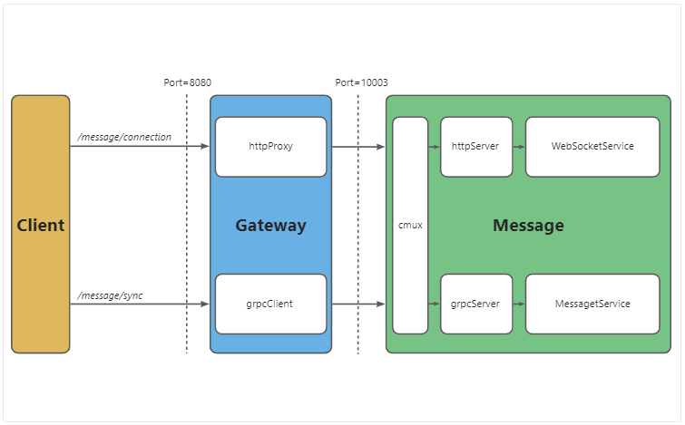

# 1 应用背景

即时通讯（Instant Messaging）模块是社交应用（如微信，以及其它APP中的私信、聊天功能）的核心模块，IM要求“服务器端向客户端主动推送数据”，即全双工通信。

用户间通信存在两种方案：

1. **P2P（Peer-to-Peer，点对点）通信 **。在 P2P 模式下，A 的手机和 B 的手机直接建立一条 TCP/UDP 连接，数据包从 A 的手机网卡发出，通过互联网路由，直接到达 B 的手机网卡， **全程不经过任何中央服务器的中转 （但需要STUN/TURN服务器管理“隧道”）**。
2. **Client-Server 模式**。常用于文本/图片聊天。不同客户端以服务器作为中介，实现双向发送、接收信息。聊天信息储存在服务器中，可实现离线储存、多端同步、内容审查等功能。

本项目采用**Client-Server 模式**，采用云端中转架构，牺牲部分隐私性换取更丰富的功能，是主流APP常用的IM实现方案。



# 2 核心技术栈

- 网络协议：WebSocket（提供持久全双工连接）、gRPC（微服务内部高速通信）
- 代理层：Gateway（负责 Token 鉴权并基于 `httputil.ReverseProxy` 桥接升级 WebSocket）
- 消息队列：Kafka（核心解耦组件，支持百万级 TPS，防止瞬时峰值压垮数据库）
- 缓存与路由：Redis Cluster（维护用户状态路由表 `Node_IP:Port`，实现分布式架构，同时作为轻量级 Inbox 缓存）
- 持久化：MySQL（安全落盘，存储完整消息体）
- 发号器：Snowflake 算法（生成全局唯一、单调递增的 MsgID，解决消息乱序问题）

## 2.1 WebSocket协议

一个标准的 WebSocket 帧结构非常紧凑（最小只有 2 个字节的头部），大致如下：

- FIN 位 ：标记这是不是消息的最后一帧（支持大文件分片）。

- Opcode（操作码） ： 定义了这个帧的类型 （只有 4 个 bit）：
  - 0x1 ：文本帧（Text Frame，通常装 JSON）

  - 0x2 ：二进制帧（Binary Frame，装图片/Protobuf）

  - 0x8 ：关闭连接帧（Close Frame）

  - 0x9 ：Ping 帧（心跳探测）

  - 0xA ：Pong 帧（心跳响应）

- Mask ：掩码位（客户端发给服务端的数据必须用掩码加密，防止缓存中毒）。

- Payload Length ：负载数据的长度。

- Payload Data ：真正的业务数据（比如你的 JSON 字符串）。

# 3 整体架构设计

在分布式场景中，可能有 100 台 Message 服务器，用户 A 连在 Node 1，用户 B 连在 Node 2。

为实现任意两个用户之间的通信，本项目采用**两级连接存储方案**：

1. **本地连接池**：每个 Message 节点内存维护一个 `sync.Map`，仅保存物理连接在这台机器上的用户（`map[UserID]*websocket.Conn`）。
2. **全局路由表**：Redis 作为统一的路由中心。当用户 A 连上 Node 1，立即执行 `SET im:route:user:A Node1_IP:Port EX 120`。如果别人想给 A 发消息，先去 Redis 查路由，得知 A 在 Node 1，通过 gRPC 内部调用 Node 1 进行推送。



# 4 业务闭环

## 4.1 连接建立与心跳保活

1. 客户端带 JWT 访问网关 `/api/v1/message/connection?token=xxx`。
2. 网关鉴权后，伪装客户端向后端 Message 服务的 HTTP 端口发起升级请求，协议转为 101 WebSocket。
3. 网关开始桥接底层的 TCP 管道，此后数据直通 Message 服务。
4. 客户端每 30 秒发一次 `ping`，服务端回 `pong`，并顺延 Redis 路由 TTL。若断网 TTL 过期，视为离线。

## 4.2 消息上行与极速 ACK

1. 用户 A 发消息给 B。Message 服务收到请求，通过 Snowflake 生成全局唯一的 `MsgID`。
2. Message 服务（作为 Producer）将消息序列化，立刻扔进 Kafka 的 `chat_msg_topic`。
3. 只要 Kafka 回复 ACK，Message 服务立刻给用户 A 返回发送成功（`ACK_SERVER`）。**（此时未查库，极快）**

## 4.3 双轨消费者模型（核心设计）

同一条消息进入 Kafka 后，被两个不同的消费组**并行拉取**：

**轨道一：Push Worker（极速触达线）**

- **目标**：以毫秒级延迟把消息送到 B 手机。
- **动作**：Worker 查 Redis `GET im:route:user:B`。如果 B 在 Node 2，Worker 通过 gRPC `PushMsgToClient` 将消息打到 Node 2。Node 2 找到本地 WS 句柄，推给 B。
- **特点**：全程纯内存与网络传输，无 DB 操作。

**轨道二：Store Worker（安全落盘与信箱线）**

- **目标**：永久保存消息，为离线补偿做准备。
- **动作**：
  1. 将完整消息体 `Insert` 进 MySQL 消息总表。
  2. 写扩散（Write-Fanout）：在 Redis 中对 B 的收件箱执行 `ZADD inbox:B <MsgID> <MsgID>`。

## 4.4 离线/弱网补偿（Pull Sync）

补全了 IM 最难的断网场景：

1. B 进入电梯断网，Push Worker 推送失败。
2. B 走出电梯重新连上 WebSocket。本地数据库记录最后收到的 MsgID = 1000。
3. 客户端主动发起 HTTP GET `/api/v1/message/sync?sync_key=1000`。
4. 服务端去 Redis 执行 `ZRANGEBYSCORE inbox:B 1001 +inf` 拿到缺失的 ID 列表。
5. 去 MySQL `IN` 查询完整消息体并返回。客户端 UI 瞬间刷出新消息。

# 5 实现细节

## 5.1 IM服务启动与初始化



在`cmd\message\main.go`中，我们通过`cmux`复用端口`10003`，设立了`HTTP Server(WebSocket)`和`gRPC Server`两个服务器。

其中`Http Server`专门负责`/message/connection`请求的处理，网关鉴权后，请求通过**代理转发**实现Client和Message之间的WebSocket通信。

其它普通业务请求任然采用gRPC实现。

## 5.2 WebSocketService

```go
type Client struct {
	UserID int64
	Conn   *websocket.Conn
	Send   chan []byte
}
```

当网关将 WebSocket 握手请求代理过来后，Message 服务处理连接的整个生命周期可以浓缩为以下 5 步核心代码逻辑：

（1）获取节点IP

（3）协议升级

（4） 登记本地内存

（5） 登记全局Redis

（6）开启读写协程

此后，HTTP 协议彻底退场，纯粹的 WebSocket 帧开始在双向流通。

```go
// 拦截 HTTP 请求，获取当前机器的 IP:Port，转交 ServeWebSocket 处理
func WsHandler(w http.ResponseWriter, r *http.Request) {
    nodeAddr := getNodeAddr() // 获取类似 "192.168.1.100:10003" 的地址
    ServeWebSocket(w, r, nodeAddr)
}
```

```go
func ServeWebSocket(w http.ResponseWriter, r *http.Request, nodeIP string) {
    // 1. 从网关塞入的 Header 中拿取 UserID
    userIDStr := r.Header.Get("X-User-Id")
    userID, _ := strconv.ParseInt(userIDStr, 10, 64)

    // 2. 将普通的 HTTP 短连接，正式升级为 WebSocket 协议长连接
    conn, err := upgrader.Upgrade(w, r, nil)
    // ...
```

```go
// 3. 构建用户专属的 Client 对象，Send 是用来发送消息的管道
client := &Client{
    UserID: userID,
    Conn:   conn,
    Send:   make(chan []byte, 256),
}

// 4. 将该用户登记到当前这台机器的本地内存连接池中 (sync.Map)
// 以后这台机器想给该用户发消息，就来这里找 client 对象
GlobalPool.AddClient(userID, client)
```

```go
// 5. 告诉全网 Redis："该用户现在连在我这台机器上，有事请 gRPC 呼叫 nodeIP"
ctx := context.Background()
if err := router.SetRoute(ctx, userID, nodeIP); err != nil {
    logger.Log.Sugar().Errorf("Failed to set route for user %d: %v", userID,
    err)
}
```

```go
// 6. 开启两个独立的协程，接管这个长连接的余生
go client.writePump() // 死死盯住 client.Send 管道，有数据就推给手机
go client.readPump(ctx) // 死死盯住 conn 底层，手机一发数据就读取并处理
```

## 5.3 ReadPump&WritePump

**readPump** 和 **writePump **是被广泛采用的**WebSocket标准设计模式 **（也是官方 gorilla/websocket 库强烈推荐的模式），其设计理念是I/O的解耦与单向数据流。

WebSocket 是一个** 全双工 **的通信协议，意味着“收”和“发”可以在同一时刻、同一条连接上独立发生。如果我们在同一个 Goroutine 里既处理读又处理写，逻辑会严重耦合，且极易导致**网络阻塞**和**竞态条件**。

因此，Pump 模式的核心理念是： 将一条物理连接（ Conn ）拆分为两个单向的逻辑水泵（Pump）：

- 读泵 ( readPump ) ：专门负责把数据从“网络”抽到“应用层”。
- 写泵 ( writePump ) ：专门负责把数据从“应用层”抽到“网络”。

它们之间互不干涉，唯一产生联系的地方就是业务逻辑。

### 5.3.1 readPump功能

1. 设置ReadDeadline，如果 60 秒内没收到用户的任何数据（包括心跳包），则认为连接超时。
2. 死循环读取 ：不断调用 c.Conn.ReadMessage() 。
3. 协议路由 ：将读到的 JSON 数据反序列化为 **WsMessage** ，然后根据 **Action** 走不同的分支：
   1. 收到 **ping** ：去 Redis 给用户的路由更新TTL，并把 pong 塞入写管道。
   2. 收到 **offline** ：主动退出循环，结束连接。
   3. 收到 **send_msg** ：调用 producer 把聊天消息扔进 Kafka，然后把 ack_server 塞入写管道。
4. 善后清理 (defer) ：如果发生网络错误或主动退出， defer 块会负责从本地 GlobalPool 和全局 Redis 中删掉该用户，并关闭底层连接。

### 5.3.2 writePump功能

主要流程：

1. 监听数据通道 ：监听Go Channel：**c.Send** 。系统的任何模块想给这个用户发消息，都只能向这个 Channel写入数据。
2. 监听心跳定时器 ：它同时盯着一个 50 秒触发一次的 **ticker.C** 。
3. select 多路复用 ：
   - 如果 c.Send 有数据 ：立刻设置 10 秒的写入超时（防卡死），然后把数据组装成 WebSocket 文本帧，通过 w.Write(message) 推给目标用户。
   - 如果定时器触发 ：不管有没有业务消息，强制给手机发送一个 PingMessage 控制帧，探测用户存活状态。

批量写入优化 ：如果 c.Send 里堆积了多条消息，它会在一次 NextWriter 中用换行符 \n 把它们拼接起来一次性发出去，极大减少网络系统调用开销。

### 5.3.3 读写分离优势

1. 防止读写互相阻塞（避免“死锁”假象）。
2. 解决并发写入的线程安全问题（所有写操作通过管道client.send）。
3. 优雅融合定时器与事件驱动（使用select）

## 5.4 Producer&Consumer

Message服务基于 Kafka 消息队列构建了一种“**发布-订阅（Pub-Sub）+ 双轨消费组**”的生产者消费者模型。

storeWorker、pushWorker和consumer均在`cmd\message\main.go`中初始化，其中storeWorker、pushWorker均通过拉起goruntine的方式运行（在for循环中通过`reader.ReadMessage(ctx)`不断消费kafka中的消息），而producer需要`ws.client.readPump()`主动调用`producer.SendMessage()`。

### 5.4.1 生产者 (Producer)

**触发时机** ：当用户通过 WebSocket 发送了一条 {"action": "send_msg"} 请求时，服务端的 readPump 协程就会调用 producer.SendMessage 。

**核心动作** ：

1. 发号 ：调用 snowflake.GenerateMsgID() 瞬间生成一个全局唯一、单调递增的 MsgID。
2. 封装序列化 ：把发送人、接收人、内容、MsgID 和时间戳打包成 Protobuf 的 Message 结构体，并序列化为 JSON 字节流。
3. 投递 Kafka ：调用底层的 kafka.SendMessage 把这包数据扔进 Kafka 的 chat_msg_topic 主题中。 这里有一个关键细节 ：它使用了 fromUserID 作为 Kafka 消息的 Key ，这保证了同一个用户发出的消息，都会落到 Kafka 的同一个 Partition（分区）里，从而保证了单用户消息的 绝对有序性 。

返回结果 ：只要成功将消息放入kafka，生产者立刻返回成功（并向客户端下发 ack_server ）。 无需等待数据库写入，也不会去等待目标用户收到消息。

### 5.4.2 消费者 (Consumer)

作为两个协程等待并处理chan消息

**运作逻辑** ：

1. 从 Kafka 拉取到一模一样的同一条消息。
2. 写数据库 ：把完整的消息内容 Insert 到 MySQL 的 messages 表中永久保存。
3. 写信箱（写扩散） ：去 Redis 里执行 ZADD inbox:{ToUserId} {MsgID} {MsgID} 。这相当于在接收者的个人信箱里插了一面小红旗，告诉他“你有一条 ID 为 xxx 的新消息”。

特点 ：涉及磁盘 I/O，相对较慢。但哪怕它因为数据库卡顿慢了 1 秒钟，也 完全不会影响 Push Worker 把消息实时推给在线的用户。

### 总结运作全景图

```plain
[用户 A] --(WS)--> [readPump] --(调用)--> [Producer]
                                            |
                                      (写入 chat_msg_topic)
                                            |
                         +------------------+------------------+
                         | (并行复制)                           | (并行复制)
                         v                                     v
             [Group: group_push]                   [Group: group_store]
             +-----------------+                   +------------------+
             |   Push Worker   |                   |   Store Worker   |
             +-----------------+                   +------------------+
             | 1. 查 Redis 路由 |                   | 1. Insert MySQL  |
             | 2. gRPC 推送     |                   | 2. ZADD Redis    |
             | 3. writePump    |                   +------------------+
             +-----------------+
                     |
                  (WS 推送)
                     v
                 [用户 B]
```

这种机制完美解决了 IM 系统的两大痛点： 在线用户的低延迟体验 （由 Push Worker 保证）和 离线用户的消息不丢失 （由 Store Worker 保证）。
